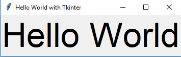

# Tkinter와 함꼐하는 Hello World

_먼저, Tkinter패키지를 가져와서 창을 만듭니다_

```python
from tkinter import *
window = Tk()
```

_창에 제목을 붙입니다._

```python
window.title("Tkinter와 함꼐하는 Hello World")
```

_format으로 창에 label을 추가합니다._

```python
lbl = Label(window, text="Hello World", font=("Arial Bold", 50))
```


_그런다음 그것의 위치와 함께 grid함수를 사용하여 그것의 위치를 설정합니다._

```python
lbl.grid(column=0, row=0)
```
_그리고 그게 다입니다. 우린 우리만의 Hello World를 가지게 될겁니다._


```python
from tkinter import *
 
window = Tk()
 
window.title("LikeGeeks app을 사용하신걸 환영합니다.")
 
lbl = Label(window, text="Hello")
 
lbl.grid(column=0, row=0)
 
window.mainloop()
```




